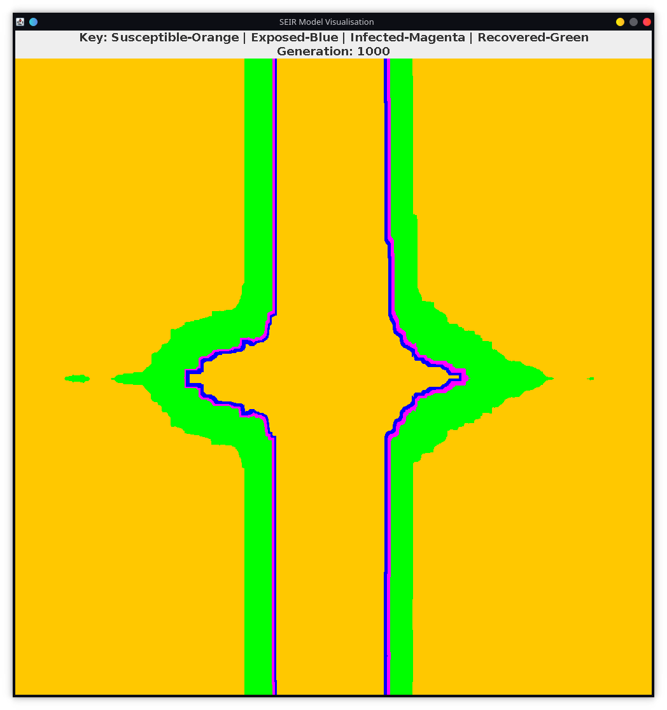

# Parallel Computing Cellular Automata Project

## Introduction

This project was created to complete an assignment with the task:

Create a two-dimensional model, based on the concept of Cellular Automata, and then To write computer programs (based on that model) which simulate the spread of the SARSCoV-2 virus through a population.

### Project overview

- This project implements the SEIR cellular automata model to predict the spread of the SARS-CoV-2 virus using both a serial and parallel program.

### SEIR Model

- The world size is 1000x1000
- Initialise world array with all susceptible and add infected with initial infected macro
- The base chance of infection is 40 percent
- Interacting with a single infected neighbour increases your infection chance by 0.0125
- Interacting with a single exposed neighbour increases your infection chance by 0.00625
- The exposed state lasts for 7 days before becoming infected
- The infected state lasts for 14 days before recovering
- The recovered state lasts for 90 days before being susceptible again
- The neighbours are defined using the Moore model


### Program Design

#### Serial Program

The serial program iterated through each cell in the world for the number of generations as defined, updating the future world and not the current world, so that the order in which the cells are checked does not affect the output and therefore makes each generation consistent.

#### Parallel Program

The parallel program uses the pthread library and implements the mutex and condition variable barrier (Pacheco 2011) in order to have the threads wait until they all have finished and are ready to continue with another generation and possibly have to output the resulting generation if required by the output sample size.

## Results and Visualisations

### Serial vs. Parallel

On average the parallel program is **2.114 times** faster

#### Screenshot of the serial program


#### Screenshot of the parallel program


### Visualisation and Graphs

This is a visualisation written in Java of the world after 1000 generations with a base infection chance of 90 percent and an infection duration of 14.



This is a graph made with Gnuplot of the population over 1000 generations with a base infection chance of 90 percent and an infection duration of 14.


## How to run

Run the following commands in the root directory of the project.

Run the following command to compile both programs

```bash
make
```

Run the following command to run the serial program

```bash
./simulation_s
```

Run the following command to run the serial program

```bash
./simulation_p
```

## Program output

The program will output the following files:

- output/world_{generation}.dat - The world at the end of each generation in the output sample size
- /population.csv - The population of each state over the output sample size

## How to change parameters

If you wish to change the parameters of the simulation, you can do so by changing the macros in the declarations.h file according to your desired parameters.

```c
// starting row and number of initial infections for generation 0
#define INITIAL_INFECTION_ROW       0
#define INITIAL_EXPOSED_NUMBER      1

// the world size as SIM_SIZE * SIM_SIZE
#define SIM_SIZE                    1000

// Number of generations
#define GEN_LENGTH                  1000

// The output to file once in every {OUTPUT_SAMPLE_SIZE}
#define OUTPUT_SAMPLE_SIZE          100

// probabilities of infection after neighbour interaction between 0 and 1
#define BASE_CHANCE                 0.40
#define EXPOSED_INFECTION_CHANCE    0.00625
#define INFECTED_INFECTION_CHANCE   0.0125

// duration of status before change (in # generations)
#define EXPOSED_DURATION            7
#define INFECTED_DURATION           14
#define REMOVED_DURATION            90

// number of neighbours using the Moore model
#define NEIGHBOUR_COUNT             8

// 0 - For no program output
// 1 - For showing the generation number as the program runs
#define GENERATION_OUTPUT           1

// number of threads for parallel program (needs to be a factor of SIM_SIZE)
#define THREAD_COUNT                8

// 0 - no debug
// 1 - output at thread begin and end
// 2 - output when thread finishes a generation
// 3 - output when thread enters critical section
// 4 - output when thread is busy waiting
#define PARALLEL_DEBUG              0

// 0 - Don't time the code
// 1 - Time the code
#define TIMER                       1

```

### Enabling debug output

If you wish to enable debug output, you can do so by changing the macros in the declarations.h file according to your desired debug level.

### For the parallel program

```c
// 0 - no debug
// 1 - output at thread begin and end
// 2 - output when thread finishes a generation
// 3 - output when thread enters critical section
// 4 - output when thread is busy waiting
#define PARALLEL_DEBUG              0
```

### For the serial program

```c
// 0 - no debug
// 1 - check_neighbour debug,
// 2 - Initialize_world debug,
// 3 - output_to_file debug
#define DEBUG                       0
```

## Flowchart


## Sources

Simulation:

- [Make file | operator](https://stackoverflow.com/a/6170280)

Visualisation:

- [File Sorting](https://mkyong.com/java8/java-8-how-to-sort-list-with-stream-sorted/)

- [WorldRenderer](https://stackoverflow.com/questions/21121859/how-to-paint-on-a-jpanel)
- [Drawline](https://stackoverflow.com/questions/4216568/java-making-a-dot-pixel-in-swing-awt)
